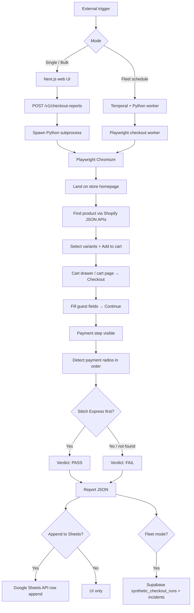
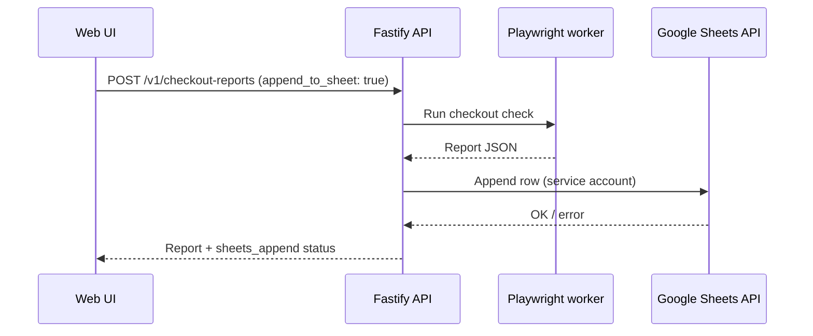

# Stitch Express Checkout Monitor (ext-trigger)

> **Type:** External-trigger automation  
> **Status:** Dev / internal  
> **Owner:** Stitch Express / Merchant Ops  
> **Repo:** [nabeelparuk-stitch/the-watcher](https://github.com/nabeelparuk-stitch/the-watcher)

---

## Summary

**The Watcher** browses Shopify stores, simulates a real guest checkout, and verifies that **Stitch Express** is the **first payment method** shown on the checkout payment step.

Stitch Express is identified by this subtitle on the payment option:

`Pay with Apple Pay | Google Pay | Capitec Pay | Card | BNPL`

(Alternate label on some stores: `Pay with Apple | Google | Capitec | Card | BNPL`)

When Stitch Express is not first — or not found — the run is flagged. Results can be viewed in the web UI, appended to **Google Sheets**, and (for fleet mode) stored in Supabase with optional **Slack** alerts.

---

## Problem

Merchants can change checkout payment ordering in Shopify without notice. Stitch Express must remain the **top** payment option for optimal conversion and wallet/BNPL visibility. Manual spot-checks do not scale across many stores.

---

## What this automation does

| Step | Action |
|------|--------|
| 1 | Accept a Shopify **store homepage** URL (or bulk list) |
| 2 | Find a purchasable product via catalog / collections APIs |
| 3 | Select variant options if required |
| 4 | Add to cart and navigate through cart → checkout |
| 5 | Fill guest shipping/contact fields and advance to **Payment** |
| 6 | Read payment methods in **visual order** on the page |
| 7 | **Pass** if Stitch Express signature is first; **fail** otherwise |
| 8 | Return a report (+ optional Google Sheets row) |

Typical runtime: **1–3 minutes per store**.

---

## Triggers

This is an **external-trigger** automation — a human or scheduler starts each run.

| Trigger | Who | How |
|---------|-----|-----|
| **Single check** | Anyone (no sign-in) | Home page → paste URL → **Run report** |
| **Bulk check** | Anyone (no sign-in) | **Bulk stores** → up to 100 URLs → **Run bulk report** |
| **Fleet sweep** | Authenticated ops | Temporal schedule (`checkout-sweep`, default every 6h) |
| **HTTP uptime** | Background worker | Temporal schedule (`probe`, every 30 min) — store reachability only |

---

## End-to-end flow



### Playwright sub-flow (per store)

1. **Land** — Open homepage or product URL  
2. **Find product** — `products.json`, collections BFS, nav “Shop” links  
3. **Variants** — Select dropdowns / radios before add-to-cart  
4. **Cart → checkout** — May require multiple “Check out” clicks (drawer → cart → checkout)  
5. **Advance** — Guest email, address, country; click Continue until Payment radios appear  
6. **Detect** — Scope to Payment section; one label per `name=basic` radio; wait for async gateways  
7. **Verdict** — Compare first method against Stitch Express signature  

---

## Pass / fail criteria

| Result | Condition |
|--------|-----------|
| **PASS** | Stitch Express label is **position #1** on checkout |
| **FAIL** | Another payment method is first |
| **FAIL / inconclusive** | Checkout could not be reached, or Stitch signature not found |

**Note:** Some stores label wallet pay differently (e.g. “Apple pay and Google pay” via Peach Payments). The monitor still lists all payment methods; Stitch pass requires the full signature text.

---

## Systems & integrations

| System | Role |
|--------|------|
| **Next.js** (`apps/web`) | Public checker UI, fleet dashboard |
| **Fastify API** (`apps/api`) | `POST /v1/checkout-reports`, Google Sheets append |
| **Python + Playwright** (`apps/checkout-worker`) | Browser automation + payment detection |
| **Google Sheets** | Optional row-per-result export |
| **Supabase** | Fleet stores, runs, incidents, auth (optional) |
| **Temporal** | Scheduled fleet checkout + HTTP probes |
| **Slack** | Optional via alert rules (fleet) |

---

## Outputs

### On-demand report (UI)

- Verdict text  
- `stitch_express_is_top` (yes / no / unknown)  
- Ordered list of payment methods found  
- Product URL used, checkout URL, duration, error details  

### Google Sheets (optional)

One row per check when **Append each report** is enabled.

| Column | Description |
|--------|-------------|
| `checked_at` | ISO timestamp |
| `input_url` | Store URL submitted |
| `verdict` | Human-readable result |
| `status` | `success` / `failure` |
| `stitch_express_is_top` | yes / no / blank |
| `first_payment_method` | Top payment label |
| `payment_methods` | All methods, pipe-separated |
| `stitch_index` | 0-based Stitch position (-1 if missing) |
| `payment_method_count` | Count detected |
| `product_url` | Product used for the run |
| `final_url` | Checkout URL reached |
| `duration_ms` | Run time |
| `error_message` | Failure detail |
| `step` | Last pipeline step |

**Spreadsheet:** [The Watcher Results](https://docs.google.com/spreadsheets/d/1zZwSynA-Jqrj4I0DNAsNNcH9x5326iDL59a4ribeLJo/edit)  
**Service account:** `the-watcher@thesupportfather.iam.gserviceaccount.com` (Editor on sheet)

### Fleet mode (Supabase)

- `synthetic_checkout_runs` — history per store  
- `stitch_checkout` incidents when Stitch is not first  
- Slack notification if alert rules configured  

---

## Configuration

### Local dev (minimum — public checker)

```bash
npm run checkout:install    # Python venv + Playwright Chromium
cp apps/api/.env.example apps/api/.env
cp apps/web/.env.example apps/web/.env.local
npm run dev:api             # :4000
npm run dev:web             # :3000
```

### Fleet (optional)

- Supabase (`supabase start`, migrations)  
- Temporal (`temporal server start-dev`)  
- `npm run dev:checkout` + `npm run checkout:schedule`  

---

## Setting up Google Sheets integration

The Watcher appends one row per checkout report using a **Google service account** (server-side). You do not sign in with Google in the browser — you share your spreadsheet with the bot email and the API writes rows on your behalf.

### How it works



| Piece | Responsibility |
|-------|----------------|
| **Service account** | Authenticates the API to Google Sheets |
| **`apps/api/.env`** | Path to JSON key + default spreadsheet ID |
| **Spreadsheet share** | Grants the service account Editor access |
| **Web UI** | Spreadsheet URL, tab name, “Append each report” toggle |

---

### Step 1 — Google Cloud project

1. Open [Google Cloud Console](https://console.cloud.google.com/).
2. Create a project (or use an existing one, e.g. `thesupportfather`).
3. Go to **APIs & Services → Library**.
4. Search for **Google Sheets API** and click **Enable**.  
   - Direct link (project-specific): enable via the API overview page for your project.  
   - Wait 1–2 minutes after enabling before testing.

---

### Step 2 — Service account + JSON key

1. Go to **IAM & Admin → Service accounts**.
2. **Create service account** (e.g. name: `the-watcher`).
3. Skip optional role grants for the service account itself (sheet access is via sharing).
4. Open the service account → **Keys → Add key → Create new key → JSON**.
5. Download the JSON file and store it **outside git** (e.g. `Thewatcherkey.json` in the project root — this filename is in `.gitignore`).

Note the **`client_email`** in the JSON, e.g.:

`the-watcher@thesupportfather.iam.gserviceaccount.com`

This is the address you will share the spreadsheet with.

---

### Step 3 — API environment variables

Edit `apps/api/.env`:

```bash
GOOGLE_SERVICE_ACCOUNT_PATH=/absolute/path/to/your-service-account.json
GOOGLE_SHEETS_DEFAULT_SPREADSHEET_ID=1zZwSynA-Jqrj4I0DNAsNNcH9x5326iDL59a4ribeLJo
GOOGLE_SHEETS_DEFAULT_SHEET_NAME=Results
```

| Variable | Required | Description |
|----------|----------|-------------|
| `GOOGLE_SERVICE_ACCOUNT_PATH` | Yes* | Absolute path to the downloaded JSON key |
| `GOOGLE_SERVICE_ACCOUNT_JSON` | Yes* | Alternative: entire JSON on one line (no path) |
| `GOOGLE_SHEETS_DEFAULT_SPREADSHEET_ID` | No | Pre-fills spreadsheet in UI; used when append is on but URL omitted |
| `GOOGLE_SHEETS_DEFAULT_SHEET_NAME` | No | Tab name (default `Results`) |

\* Use one of `GOOGLE_SERVICE_ACCOUNT_PATH` or `GOOGLE_SERVICE_ACCOUNT_JSON`.

Restart the API after changing `.env`:

```bash
npm run dev:api
```

---

### Step 4 — Create and prepare the spreadsheet

1. Create a [Google Sheet](https://sheets.google.com) (or use an existing one).
2. Add a tab named **`Results`** (or another name — must match `GOOGLE_SHEETS_DEFAULT_SHEET_NAME` / UI setting).
3. Copy the spreadsheet URL, e.g.:  
   `https://docs.google.com/spreadsheets/d/1zZwSynA-Jqrj4I0DNAsNNcH9x5326iDL59a4ribeLJo/edit`
4. The spreadsheet ID is the long string between `/d/` and `/edit`.

**Column headers** are written automatically on first append if row 1 is empty.

---

### Step 5 — Share the spreadsheet with the service account

1. In Google Sheets, click **Share**.
2. Add the service account email (`client_email` from the JSON).
3. Role: **Editor** (not Viewer).
4. Uncheck “Notify people” (the service account is not a real inbox).
5. Click **Share**.

Without this step you will see: *Permission denied. Share the spreadsheet with the service account email as Editor.*

---

### Step 6 — Verify the integration

**Option A — API status endpoint**

```bash
curl http://127.0.0.1:4000/v1/google-sheets/status
```

Expected when configured:

```json
{
  "configured": true,
  "serviceAccountEmail": "the-watcher@thesupportfather.iam.gserviceaccount.com",
  "defaultSpreadsheetId": "1zZwSynA-Jqrj4I0DNAsNNcH9x5326iDL59a4ribeLJo",
  "defaultSheetName": "Results"
}
```

**Option B — Test append script**

```bash
cd apps/api
npx tsx scripts/test-sheets-append.ts
```

Success returns `"ok": true` and an `updatedRange` like `Results!A2:N2`.

---

### Step 7 — Enable append in the web UI

1. Open http://localhost:3000
2. Below the URL form, expand **Google Sheets**.
3. Confirm the **service account email** is shown.
4. Paste your **Spreadsheet URL or ID** (auto-filled if `GOOGLE_SHEETS_DEFAULT_SPREADSHEET_ID` is set).
5. Set **Sheet tab name** (e.g. `Results`).
6. Check **Append each report as a new row in Google Sheets**.

Settings are saved in your browser (`localStorage`) for next visits.

---

### Single vs bulk

| Mode | Sheets behaviour |
|------|------------------|
| **Single store** | One row appended after each **Run report** (if checkbox on) |
| **Bulk stores** | **Append each report** must be enabled; one row per store, sequentially |
| **Fleet** | Does not auto-append to Sheets today (Supabase only) |

After each run, the report shows **Google Sheets → Row appended** or an error message. A failed sheet append does **not** block the checkout report itself.

---

### Security notes

- Never commit the service account JSON or `apps/api/.env` to git (both are gitignored).
- Rotate keys in Google Cloud if a key is exposed.
- The service account only needs access to spreadsheets you explicitly share with it.
- For production, store the JSON in a secrets manager and inject via env at deploy time.

---

## Operator guide

### Single store

1. Open http://localhost:3000 (or deployed URL)  
2. Paste Shopify **homepage** URL  
3. (Optional) Google Sheets → enable **Append each report**  
4. Click **Run report**  
5. Review verdict + payment order (~1–3 min)  

### Bulk stores (up to 100)

1. Click **Bulk stores**  
2. Paste URLs, **one per line**  
3. Enable **Append each report** in Google Sheets  
4. Click **Run bulk report**  
5. Each store runs sequentially; one sheet row per completion  
6. Use **Cancel** to stop between stores  

### Fleet monitoring

1. Sign in at `/login`  
2. Add stores under **Fleet**  
3. Configure checkout product URL per store  
4. View incidents and Slack alerts when Stitch drops from first position  

---

## Troubleshooting

| Symptom | Likely cause | Fix |
|---------|--------------|-----|
| Only 1–2 payment methods listed | Detection ran before gateways loaded, or label filter too strict | Ensure latest `stitch_detect.py`; wait for full payment step |
| Stitch not found but wallets visible | Store uses different label (e.g. Peach / “Apple pay and Google pay”) | Review raw payment list; signature may differ from Stitch Express |
| Checkout timeout | Slow store, CAPTCHA, or geo block | Retry; check store manually |
| Google Sheets “Permission denied” | Sheet not shared with service account | Share with `the-watcher@…` as Editor |
| Google Sheets API error | API not enabled in GCP | Enable Sheets API; wait a few minutes |
| Playwright browser missing | Chromium not installed | `npm run checkout:playwright` |
| API 502 | Python worker crash | Check API logs; verify `CHECKOUT_WORKER_DIR` in `.env` |

---

## Related links

- **GitHub:** https://github.com/nabeelparuk-stitch/the-watcher  
- **Google Sheet (results):** https://docs.google.com/spreadsheets/d/1zZwSynA-Jqrj4I0DNAsNNcH9x5326iDL59a4ribeLJo/edit  
- **Reference doc format:** [Low-Balance-Automation (ext-trigger)](https://app.notion.com/p/stitchmoney/Low-Balance-Automation-ext-trigger-8430d9c012464570bbc78b5e70410307)  

---

## Changelog

| Date | Change |
|------|--------|
| 2026-05 | Initial monitor: single + bulk checks, Google Sheets export, Stitch payment detection |
| 2026-05 | Added Google Sheets setup guide |
